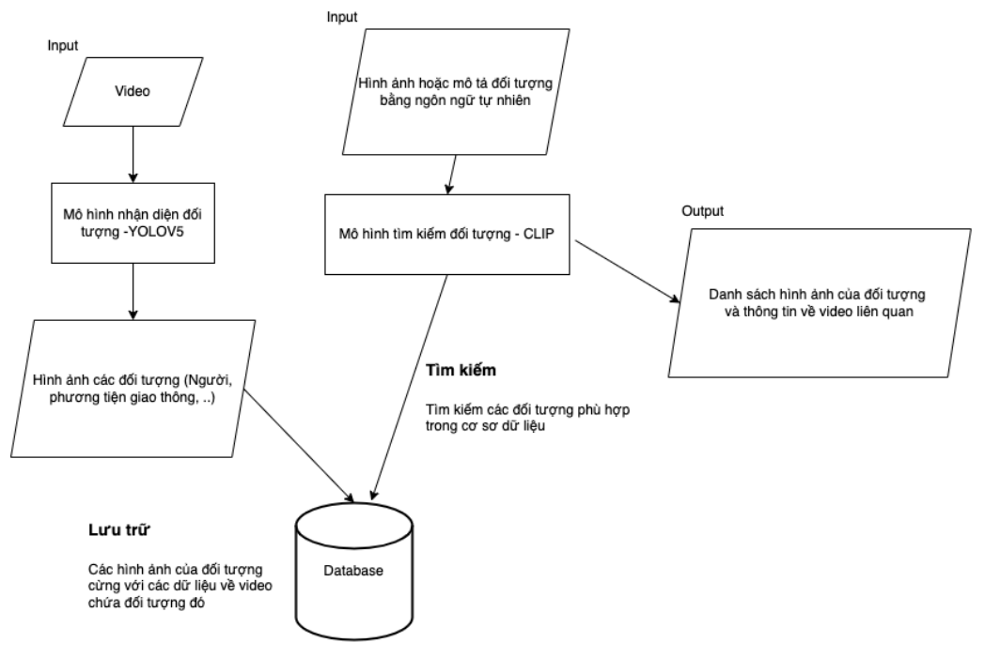

# 🎯 Text-Based Object Retrieval in Surveillance Video

Hệ thống này cho phép người dùng **tìm kiếm đối tượng trong video giám sát bằng mô tả văn bản**, ví dụ: `"a red motorcycle"` hoặc `"a green chair"`. Hệ thống sử dụng YOLO để nhận diện đối tượng trong video, lưu trữ ảnh đối tượng vào cơ sở dữ liệu, và dùng CLIP để truy vấn văn bản gần giống về mặt ngữ nghĩa.

---

## 🧠 Kiến trúc hệ thống



> **Ảnh: Sơ đồ hệ thống gồm 3 thành phần chính:**
> 1. **Object Detection:** Trích xuất các đối tượng từ video bằng YOLO.
> 2. **Feature Indexing:** Sử dụng CLIP để mã hóa hình ảnh và lưu FAISS index.
> 3. **Text Query:** Người dùng nhập mô tả văn bản → CLIP encode → FAISS tìm ảnh gần nhất.

---

## ⚙️ Yêu cầu

- Python >= 3.8
- pip + venv (hoặc conda)
- Cài đặt các thư viện:

```bash
pip install git+https://github.com/openai/CLIP.git
pip install faiss-cpu flask opencv-python torch torchvision
